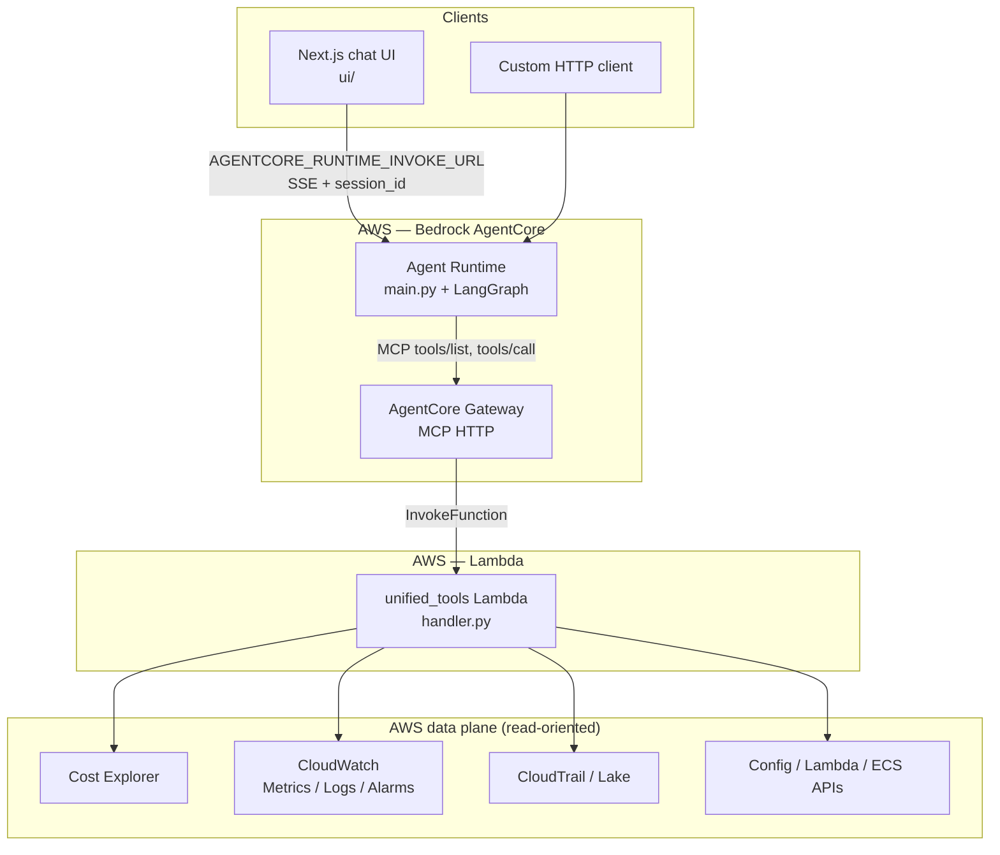
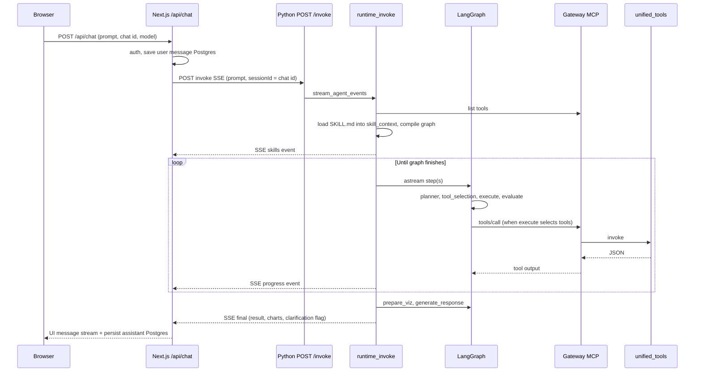

# Cloud Intelligence Agent — Project Documentation

Technical overview: what the repo contains, how requests flow, and where the main code lives.

---

## 1. What this project does

A **LangGraph** agent (Claude on Amazon Bedrock) answers natural-language questions about **AWS** by planning steps, calling tools, and returning text plus **charts** when tool output can be visualized.

- **Tools** are not called from the agent process with raw boto3. The agent uses **MCP** against an **AgentCore Gateway**; each tool is implemented in a single **Lambda** (`lambdas/unified_tools/`) that performs read-oriented AWS API calls (Cost Explorer, CloudWatch metrics/logs, CloudTrail-related APIs, discovery helpers, etc.).
- **Agent Skills** live under `agent/skills/*/SKILL.md` (YAML frontmatter + playbook markdown). On each invoke, the runtime builds **skill context** (short id/name/description lines plus full playbooks) and prepends it to the graph’s planner / tool-selection / evaluate / final-answer prompts. There is **no separate skill-router model call**; all Gateway tools remain available and the graph chooses which to run.
- **Next.js UI** (`ui/`) streams chat to the agent over HTTP (SSE-style). The UI persists **chats and messages in Postgres** (see `ui/` DB layer). That is separate from **LangGraph state** inside the agent process, which holds conversation and tool results for the current run (with an in-memory or optional SQLite checkpointer keyed by `session_id`).

---

## 2. Architecture

### 2.1 High-level diagram

### 2.2 Request flow — detailed (Cloud Intelligence path)

Below is the full path for one **assistant turn** when the user selects the Cloud Intelligence model. Other chat models skip the Python agent and use `streamText` in the same route instead.

#### A. Browser → Next.js (`ui/`)

1. The user submits a message. **`useChat`** (via `ActiveChatProvider` / `use-active-chat.tsx`) sends **`POST /api/chat`** with JSON that includes **`id`** (chat id), the new **user message** (parts), **`selectedChatModel`** (Cloud Intelligence id), and visibility. **`prepareSendMessagesRequest`** may send **`message`** only or full **`messages`** for tool-approval continuations.
2. The route runs **auth**, **rate limits**, loads or creates the chat, and **saves the user message to Postgres** before streaming the assistant reply.
3. For Cloud Intelligence, the handler does **not** call Vercel AI Gateway for the assistant text. It opens **`createUIMessageStream`**: writes **`start`** (assistant `messageId`), then consumes the agent HTTP stream (next section).

#### B. Next.js → Python agent HTTP (`ui` → `agent`)

1. **`streamAgentcoreRuntimeEvents`** in `ui/lib/agentcore/invoke-runtime.ts` **`POST`s** to **`AGENTCORE_RUNTIME_INVOKE_URL`** (e.g. `http://127.0.0.1:8080/invoke`) with **`Content-Type: application/json`**, **`Accept: text/event-stream`**, body **`{ prompt, session_id, sessionId }`**. **`sessionId`** is the **chat id** so LangGraph’s **`thread_id`** lines up with the UI thread.
2. Optional header **`AGENTCORE_AUTH_HEADER`** is forwarded if set.
3. The response body is **SSE**: each event is a line **`data: <json>`** (see `agent/src/local_http.py`: `_sse_bytes`). The UI parser **`iterateAgentcoreRuntimeEvents`** (`ui/lib/agentcore/parse-runtime-sse.ts`) yields **`skills`**, **`progress`**, then a single **`final`** object.

#### C. Python entry: Starlette `POST /invoke` (`agent/src/local_http.py`)

1. Parses JSON body to a **payload** dict.
2. **`StreamingResponse`** runs **`_event_stream`**: **`async for event in stream_agent_events(payload)`** and encodes each dict as SSE bytes.

#### D. Runtime: `stream_agent_events` (`agent/src/runtime_invoke.py`)

1. **Read** **`prompt`** and **`session_id`** / **`sessionId`** from the payload (defaults if missing).
2. **MCP tools:** **`get_streamable_http_mcp_client()`** → **`get_tools()`** — loads the full tool list from the Gateway (tool names like `unified-aws-tools___get_cost_and_usage`).
3. **Skills:** **`route_skills_for_prompt(prompt)`** reads every **`agent/skills/*/SKILL.md`**, builds **`skill_context`** markdown (quick reference + full playbooks). **No extra LLM call.** Returns **`selected_ids`** (all skill ids for logging/UI), **`allowed_tool_bases=None`**, **`used_full_tool_fallback=True`** (meaning: do not filter MCP tools).
4. **`filter_tools_by_allowlist(all_tools, None)`** → **all** MCP tools remain. **`scoped_tools`** = **`ask_user`** + **`visualize_data`** (local) **+** MCP tools.
5. **First SSE to client:** **`yield { stage: "skills", skills: [...], full_tools_fallback }`** so the UI can show which skills’ playbooks were loaded.
6. **Graph:** **`build_graph(..., scoped_tools=scoped_tools, skill_context=route.context_markdown)`** with **`checkpointer`** from **`_resolve_checkpointer()`** (in-memory by default, optional SQLite if **`LANGGRAPH_CHECKPOINT_SQLITE`** is set). **`configurable.thread_id`** = **`session_id`**.
7. **Input state:** **`messages: [HumanMessage(content=prompt)]`**, **`results: []`**, **`iteration: 0`**. With a checkpointer, prior **`thread_id`** messages may be **merged** via **`add_messages`** (so multi-turn can include earlier turns in state).
8. **`async for state in graph.astream(input_state, config, stream_mode="values")`:** after each full graph step, **`yield { stage: "progress", message }`** where **`message`** is derived from planner / tool selection / execute / evaluate deltas (`_progress_message`).
9. After the stream ends, the runtime builds **final text** from the last graph state (AI message content, fallbacks for empty text), runs **`build_cost_chart_specs_from_results`** on **`results`** for **Plotly** payloads, sets **`clarification_needed`** if any result is **`ask_user`**, strips duplicate PNG markdown when specs exist, optional auto-viz markdown append.
10. **Last SSE:** **`yield { result, charts, clarification_needed, ... }`** (no **`stage: progress`**).

#### E. LangGraph internals (`agent/src/graph/build.py`, `nodes.py`)

**Edges:** **`__start__` → planner → tool_selection → execute → evaluate → loop_controller** → conditional → either **`planner`** again or **`prepare_viz` → generate_response → `__end__`**.

**Per iteration (until evaluate says done or `iteration >= max_iterations`):**

1. **Planner** — Single Bedrock call: human-style prompt = **`skill_context`** prefix + **`PLANNER_PROMPT`** (truncated recent **`messages`**, prior **`plan`**, **`evaluation`**). Writes new **`plan`** string, increments **`iteration`**.
2. **Tool selection** — Bedrock call: prefix + **`TOOL_SELECTION_PROMPT`** + tool descriptions + conversation snippet + **`plan`**. Model returns JSON **`{ "tool_calls": [ { "name", "arguments" }, ... ] }`** → **`selected_tools`**.
3. **Execute** — For each selected tool:
   - **Cost date guard:** if the tool is a date-sensitive cost API and the **latest user message** does not match **`user_specified_cost_time_range`**, **skip real tools** and append a synthetic **`ask_user`** result with **`_clarification_gate`**; **evaluate** will force **done**.
   - Else **resolve** tool by name (supports Gateway **`Target___tool`** suffixes), **`ainvoke(arguments)`**, **`unwrap_tool_output`**, append to **`results`** and append **`ToolMessage`** to **`messages`**.
4. **Evaluate** — If **`_clarification_gate`** in **`results`**, **`evaluation: done`**. Else Bedrock call with **`EVALUATE_PROMPT`** + **`results`** preview → **`done` | `continue` | `retry`** (normalized to lowercase).
5. **Loop controller** — No-op state passthrough; routing function sends to **`prepare_viz`** if **`evaluation == done`** or **max iterations**, else back to **`planner`**.

**After the loop:**

6. **prepare_viz** — **`run_visualization_pipeline`** on **`results`** (+ optional message fallback) produces **`chart_markdown`** (tables / legacy markdown charts) stored on state.
7. **generate_response** — Bedrock call with **`FINAL_RESPONSE_PROMPT`** + **`results`** preview. If a successful **`ask_user`** result exists, **replace** assistant text with that question only (**no** chart append from **`prepare_viz`** for that path). Otherwise append **`chart_markdown`** and legacy **`visualize_data`** / **`build_auto_viz_from_results`** as implemented. Emits final **`AIMessage`** **`content`**.

**Prompt windowing:** **`_msg_preview`** / **`_results_preview`** only **truncate what is sent to the next LLM call**; full tool strings still accumulate in **`state.results`** and **`messages`** unless you add separate pruning.

#### F. One MCP tool call (execute node → AWS)

1. **`BaseTool.ainvoke`** for a Gateway tool goes through the LangChain MCP adapter configured in **`mcp_client/client.py`**.
2. The Gateway invokes **`unified_tools`** Lambda with the tool name and payload expected by **`handler.py`**.
3. Lambda runs boto3 against AWS APIs and returns JSON (sometimes wrapped in content blocks).
4. The agent **unwraps** nested payloads in **`tool_output_unwrap.py`** before storing in **`results`**.

#### G. UI stream mapping (`route.ts` Cloud Intelligence branch)

1. **`for await` `streamAgentcoreRuntimeEvents`:** on **`skills`**, update activity UI; on **`progress`**, append deduped steps; on **`final`**, capture **`parsed`**.
2. **`emitActivity(true)`** hides the activity panel.
3. **`text-start` / `text-delta` / `text-end`** stream **`parsed.result`** (plus clarification footer if **`clarificationNeeded`**).
4. If **`parsed.charts.length`**, **`data-cost-charts`** with Plotly specs.
5. **`finish`**, optional **`data-chat-title`** for new chats.
6. **`onFinish`** persists assistant **`parts`** to Postgres; **`stripAgentActivityParts`** removes **`data-agent-activity`** so ephemeral steps are not stored.

### 2.3 Repository layout

| Path | Role |
|------|------|
| `agent/` | LangGraph agent, Bedrock chat model, MCP client, skills loader, viz pipeline, local HTTP / AgentCore entry. |
| `lambdas/unified_tools/` | Single Lambda: Gateway tool implementations + IAM policy reference. |
| `lambdas/gateway_inline_schema.json` | Tool definitions for Gateway inline schema. |
| `ui/` | Next.js app: chat, Postgres persistence, streams agent SSE, Plotly for cost charts. |
| `agent/.bedrock_agentcore/` | Docker / deploy assets for AgentCore. |

Infrastructure for Lambda and Gateway is not generated from this repo (console/CLI per component READMEs).

---

## 3. Key files

| Topic | File(s) |
|-------|---------|
| Runtime / SSE invoke loop | `agent/src/runtime_invoke.py`, `agent/src/main.py`, `agent/src/local_http.py` |
| Graph & nodes | `agent/src/graph/build.py`, `nodes.py`, `state.py` |
| Agent Skills | `agent/skills/*/SKILL.md`, `agent/src/skills/load.py`, `router.py` (builds prompt context only) |
| MCP | `agent/src/mcp_client/client.py` |
| Tool unwrap | `agent/src/tools/tool_output_unwrap.py` |
| Viz pipeline | `agent/src/viz_pipeline/`, `agent/src/tools/visualization.py` |
| AWS tool implementations | `lambdas/unified_tools/handler.py` |
| Gateway schema | `lambdas/gateway_inline_schema.json` |
| Chat API + agent stream client | `ui/app/(chat)/api/chat/route.ts`, `ui/lib/agentcore/*` |
| Cost charts UI | `ui/components/chat/cost-charts-panel.tsx` |
