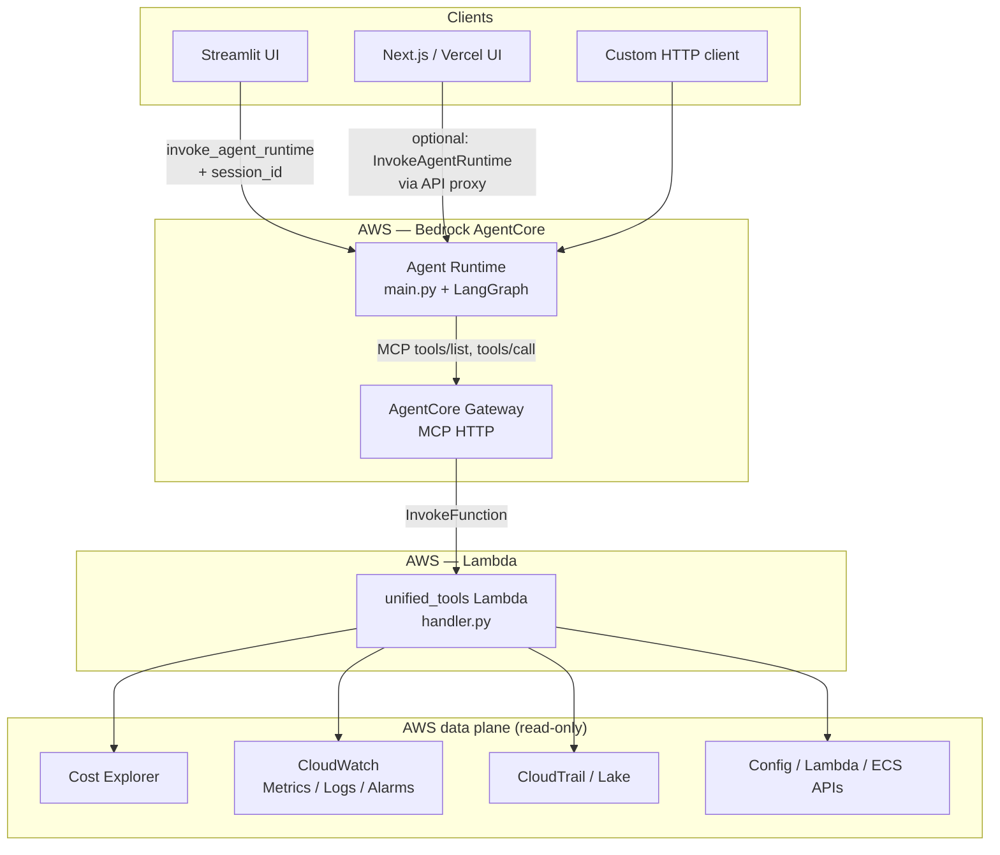

# Cloud Intelligence Agent — Project Documentation

*End-to-end documentation for the Cloud Intelligence platform: agent, tools Lambda, UIs, and deployment on AWS Bedrock AgentCore.*

---

## 1. Problem statement

**Organizations running on AWS struggle to get fast, accurate answers that combine billing, observability, and audit data.** Typical pain points:

| Pain | Why it hurts |
|------|----------------|
| **Fragmented consoles** | Cost Explorer, CloudWatch, CloudTrail, and Config each answer part of the question; correlating “why did cost spike?” with “what changed in infra?” requires many clicks and exports. |
| **Steep learning curve** | Correct CE filters, Logs Insights queries, and Trail lookups need AWS expertise; ad-hoc questions block on the few people who know the APIs. |
| **Slow ad-hoc analysis** | Each investigation is a manual loop: hypothesize → query → export → spreadsheet → repeat. No single natural-language surface tied to **live** account data. |
| **Visualization gap** | Raw JSON from APIs is hard to consume; stakeholders want charts without building a BI pipeline for every question. |
| **Governance & scope** | Teams want assistants that only invoke **allowed** capabilities (e.g. cost-only for FinOps, audit-only for security) without exposing destructive or out-of-scope APIs. |

This project addresses that by providing a **conversational AWS intelligence layer**: one agent that reasons over **Cost Explorer, CloudWatch (metrics/logs), CloudTrail (and Lake), and discovery APIs**, with optional **domain scoping**, **server-side chart generation**, and **pluggable frontends**—deployable as a **Bedrock AgentCore** runtime with tools behind a **Gateway + single Lambda**.

---

## 2. Proposed solution

**A LangGraph-based agent** (Claude on Bedrock) orchestrates multi-step plans: it selects tools, executes them via **MCP → AgentCore Gateway → unified_tools Lambda**, interprets structured results, and returns natural-language answers plus **normalized visualizations** (cost curves, forecasts, metrics, logs) when appropriate.

**Core ideas:**

1. **Single tool surface** — Dozens of AWS read operations are exposed as Gateway tools implemented in one Lambda (`lambdas/unified_tools/handler.py`), keeping deployment and IAM boundaries simple.
2. **Agent never calls AWS directly** — The agent only talks MCP to the Gateway; all AWS credentials and API logic stay in Lambda (and Gateway invoke permissions).
3. **Domain scoping** — Payload `scope` (`cost` | `logs` | `audit` | `discovery` | `all`) or inferred intent filters which tools are visible (`agent/src/scoping/domains.py`), reducing prompt injection surface and aligning with least-privilege narratives.
4. **Ad-hoc, no app database** — Conversation and tool results for a turn are held in **LangGraph state** with an **in-memory checkpointer** (`InMemorySaver`); no customer data warehouse is required for Q&A (see limitations for durability).
5. **Visualization pipeline** — Cost/forecast/metric/log-shaped JSON is normalized and rendered (e.g. matplotlib → base64 PNG in markdown) so users see charts without relying on the LLM to draw them reliably.

---

## 3. Architecture diagram and explanation

### 3.1 High-level architecture

### 3.2 Request flow (typical chat turn)

1. **Client** sends `prompt`, optional `scope`, optional `session_id` / `sessionId` to **AgentCore Runtime** (Streamlit uses `bedrock:InvokeAgentRuntime` with config from `.bedrock_agentcore.yaml`).
2. **Runtime** (`agent/src/main.py`) loads the LangGraph app with **InMemorySaver** keyed by `thread_id` = session id.
3. **Graph** (`agent/src/graph/`): planning → tool selection → **execute** (MCP tool calls) → evaluation → loop or **generate_response**; optional **prepare_viz** path merges chart markdown into the final reply.
4. **MCP client** (`agent/src/mcp_client/client.py`) targets the Gateway URL; each tool call becomes **Lambda invocation** with tool name + arguments (`bedrockAgentCoreToolName` in payload).
5. **unified_tools Lambda** routes to boto3 calls (CE, CW, Trail, etc.) and returns JSON (sometimes wrapped in content blocks; the agent **unwraps** to plain JSON for storage and viz — `agent/src/tools/tool_output_unwrap.py`).
6. **Response** streams back to the client (SSE-style events) with final text and embedded chart images where generated.

### 3.3 Repository layout (what lives where)

| Path | Role |
|------|------|
| `agent/` | LangGraph agent, Bedrock model, MCP client, domain scoping, viz pipeline, AgentCore entrypoint. |
| `lambdas/unified_tools/` | Single Lambda: all Gateway tools + `iam-policy-unified-tools.json`. |
| `lambdas/gateway_inline_schema.json` | Tool definitions for Gateway inline schema. |
| `streamlit-ui/` | Reference chat UI → Runtime direct. |
| `ui/` | Next.js-style proxy pattern for HTTP invoke URL. |
| `agent/.bedrock_agentcore/` | Docker / deploy assets for AgentCore. |

*Note: This repo does not include CDK/Terraform; Lambda and Gateway are wired via console/CLI per READMEs.*

---

## 4. Unique edge / differentiators

| Differentiator | Description |
|----------------|-------------|
| **Domain scoping** | Tools are filtered per **cost / logs / audit / discovery / all** so the same agent can be deployed with different “personalities” or compliance postures without separate codebases. |
| **In-memory ad-hoc analysis** | No application database for Q&A; each session uses LangGraph state + in-memory checkpoint. Ideal for **exploratory** questions without standing up a data lake first. |
| **One Lambda, many tools** | Adding a tool = handler branch + schema line + optional domain set in `domains.py`. Gateway syncs schema; agent picks up tools via MCP. |
| **Viz + normalization** | Server-side pipeline (`agent/src/viz_pipeline/`, `tools/visualization.py`) turns CE/forecast/metric/log JSON into **consistent charts**; avoids LLM token limits and malformed chart output. **Unwrap** layer handles MCP/content-block quirks. |
| **Swappable frontend** | Streamlit today; `ui/` shows HTTP invoke. Same runtime works with **Slack bot, internal portal, or runbook**—anything that can call AgentCore. |
| **Composable “sub-agent”** | Can be embedded as **one agent in a larger system** (e.g. FinOps platform calls this runtime for AWS-specific reasoning) with no requirement to ship the Streamlit UI. |
| **AWS-native, customer-owned** | Runs in **your** account with **your** IAM; data does not need to flow to a third-party SaaS for the core Q&A path (contrast with many FinOps SaaS aggregators). |
| **Gateway abstraction** | Agent code stays MCP-only; you can point **GATEWAY_MCP_URL** at another Gateway (e.g. staging) without changing agent logic. |

---

## 5. Who is this tool for (target users)

| Persona | Use cases |
|---------|-----------|
| **FinOps / cloud economics** | Natural language cost by service/region/tag, forecasts, comparisons, drivers; charts for leadership. |
| **Engineering leads / SRE** | Correlate spend with metrics and logs; “what’s noisy in this log group?” style questions. |
| **Security / compliance** | CloudTrail lookups, Lake queries (where enabled), audit-focused scoping without cost tools in the same session if desired. |
| **Platform / cloud center of excellence** | Standardized “ask AWS” capability inside the org; discovery tools for Lambda/ECS/Config inventory. |
| **AWS partners** | White-label or internal accelerator: drop-in AgentCore + Lambda for customer accounts (with appropriate IAM). |

---

## 6. Cost / time savings (projected metrics)

*Illustrative ranges for internal business cases—calibrate with your own baselines.*

| Metric | Assumption | Projected impact |
|--------|------------|------------------|
| **Analyst time per ad-hoc cost question** | Today: 15–45 min across CE + spreadsheets | **50–70% reduction** when answer is one conversational turn + chart (e.g. **~5–15 min** equivalent effort). |
| **Time to first chart** | Manual: export + Excel/Sheets | **&lt; 1 minute** after response (generated in-pipeline). |
| **Tickets avoided** | “How much did X cost last month?” style L1 | **20–40%** of repetitive cost questions deflected if self-serve (org-dependent). |
| **Training cost** | New hire learning CE + CW query syntax | **Faster ramp** (weeks → days) for read-only investigation patterns—qualitative. |
| **Infra cost of the solution** | Bedrock tokens + Lambda + Gateway | Typically **small vs. dedicated FinOps headcount** or enterprise SaaS seats; exact $ depends on model, traffic, and region. |

**Example ROI sketch:**  
1 FinOps engineer @ fully loaded **$150k/year** spending **10 h/week** on repeatable CE/CW lookups → **~$36k/year** labor in that bucket. A **30% efficiency gain** → **~$11k/year** equivalent; if the deployed stack costs **$2–5k/year** (illustrative), payback is plausible in year one *for that slice alone*—scale with team size and query volume.

---

## 7. Current limitations

| Limitation | Detail |
|------------|--------|
| **Session memory durability** | **InMemorySaver** is process-scoped. Cold starts or new containers lose thread state; **DynamoDB (or similar) checkpointer** is noted in README as the path to durable multi-turn memory. |
| **Single-cloud focus (in code)** | Tooling is **AWS-centric** (CE, CW, Trail, Config, etc.). No Azure/GCP tools in this repo. |
| **Read-only intelligence** | Lambda policy is **read-oriented**; no automated rightsizing or resource modification from this agent. |
| **No in-repo IaC** | Deployment steps are manual (zip Lambda, Gateway console); enterprise buyers may want **CDK/Terraform modules**. |
| **Model & rate limits** | Long investigations hit **iteration caps** and Bedrock **token limits**; very large CE responses may need summarization strategies. |
| **CloudTrail Lake** | Requires Lake to be **set up and authorized**; not all accounts use Lake queries the same way. |
| **Gateway schema sync** | New tools require **inline schema update + sync** on the Gateway. |

---

## 8. Competitor analysis

| Category | Examples | vs. this project |
|----------|----------|-------------------|
| **Enterprise FinOps SaaS** | CloudZero, Vantage, Apptio Cloudability, Anodot | SaaS offers **multi-cloud**, curated dashboards, anomaly alerts, and often **optimization actions**. This project is **AWS-native, in-VPC/account**, **conversational**, and **extensible via Lambda**—better for **data residency**, **custom tool expansion**, and **Bedrock-centric** shops. |
| **AI FinOps agents (commercial)** | Gruve AI, CloudAct ELSA, ZOLIX, Umbrella “CostGPT”-style | Often **outcome-based pricing**, **Jira/Slack**, **multi-cloud**. This repo is **self-hosted**, **open to fork**, and integrates **your** Gateway tools—not a black box. |
| **Kubernetes cost tools** | Kubecost, OpenCost | Strong **K8s allocation**; this agent does **not** replace them but could **complement** (AWS CE + discovery) for non-K8s or hybrid narratives. |
| **AWS native** | Cost Explorer UI, Cost Anomaly Detection, **Amazon Q** (where licensed) | Native UIs are **not conversational multi-step** across Trail + logs + CE in one flow. **Q** is broader but **productized**; this stack is **fully customizable** (prompts, tools, scoping). |
| **Build-your-own LLM + AWS** | Ad-hoc scripts | This project provides **production-shaped** pieces: **LangGraph**, **Gateway**, **unified Lambda**, **viz pipeline**, **two UIs**. |

**Positioning line:** *“AWS-grounded conversational FinOps + observability + audit, in your account, with domain-scoped tools and optional charts—not a replacement for full FinOps platforms but a fast path to intelligent ad-hoc analysis and embeddable agent.”*

---

## 9. How to sell this

1. **To engineering leadership** — “**Shrink time-to-answer** for ‘why is my bill up?’ and ‘what’s logging the most?’ without training everyone on four consoles.”
2. **To security / GRC** — “**Scoped audit agent**: Trail and Lake tools only, same runtime pattern as cost—governance-friendly.”
3. **To FinOps** — “**Self-serve CE + forecast + charts** in chat; fewer tickets to the central team.”
4. **To partners / SI** — “**Accelerator**: AgentCore + Lambda blueprint you can replicate per customer with IAM boundaries.”
5. **To platform teams** — “**API-first**: any UI or workflow can call the same runtime; Streamlit is a demo.”

**Packaging ideas:**  
- **Internal platform SKU** (“Cloud Intelligence Chat”).  
- **Paid pilot** with success metrics: queries/week, median time saved, stakeholder NPS.  
- **Add-on** to existing AWS MAP or professional services engagements.

---

## 10. What can be added next

| Enhancement | Value |
|-------------|--------|
| **DynamoDB checkpointer** | Durable sessions across invocations and cold starts. |
| **IaC (CDK)** | One-click deploy: Lambda + Gateway wiring + Runtime. |
| **Write-safe “action” tools** (behind flag) | e.g. create budget, tag resources—with strict IAM and human approval step. |
| **Multi-account / Organizations** | Assume-role or stack-set aware tools for payer account views. |
| **Caching layer** | Short TTL cache for expensive CE queries to cut cost and latency. |
| **Evaluation harness** | Golden questions + expected tool traces for regression testing after prompt/tool changes. |
| **Slack / Teams bot** | Thin wrapper over `InvokeAgentRuntime`. |
| **RAG on internal docs** | Combine with runbooks (“what’s our tagging standard?”) alongside live AWS tools. |
| **GCP / Azure tools** | Second Lambda or target group for true multi-cloud parity with commercial FinOps. |
| **Anomaly + scheduled reports** | EventBridge + summarization agent (beyond ad-hoc). |

---

## 11. Quick reference — key files

| Topic | File(s) |
|-------|---------|
| Runtime entry | `agent/src/main.py` |
| Graph & nodes | `agent/src/graph/build.py`, `nodes.py`, `state.py` |
| Domain scoping | `agent/src/scoping/domains.py` |
| MCP | `agent/src/mcp_client/client.py` |
| Tool unwrap / CE JSON | `agent/src/tools/tool_output_unwrap.py` |
| Viz pipeline | `agent/src/viz_pipeline/pipeline.py`, `tools/visualization.py` |
| All AWS tool implementations | `lambdas/unified_tools/handler.py` |
| Gateway schema | `lambdas/gateway_inline_schema.json` |
| Streamlit | `streamlit-ui/app.py`, `bedrock_direct.py` |

---

*Document version: aligned with repository structure as of project review. Update sections 6–8 with your measured KPIs and competitive intel as you gather them.*
